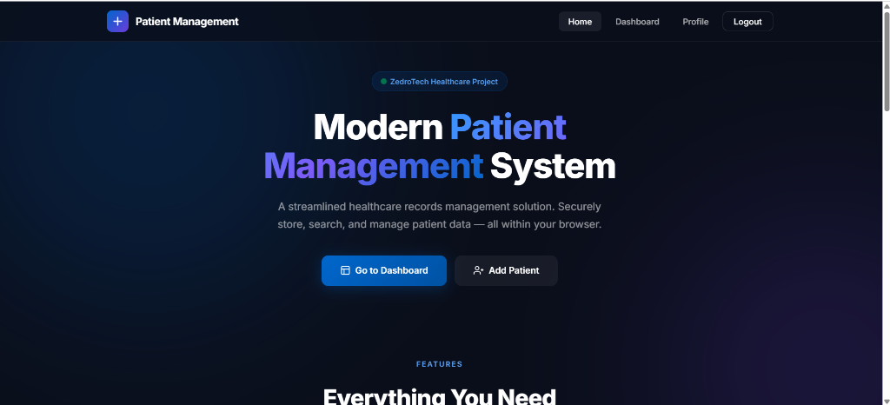
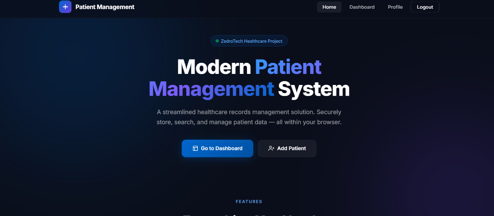
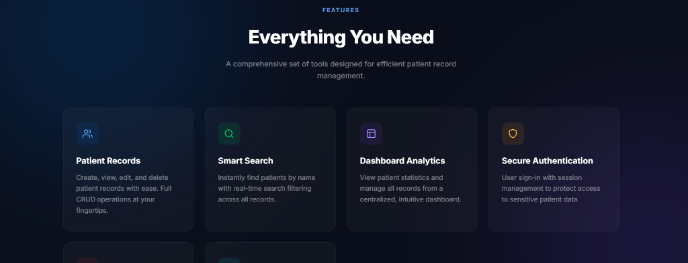
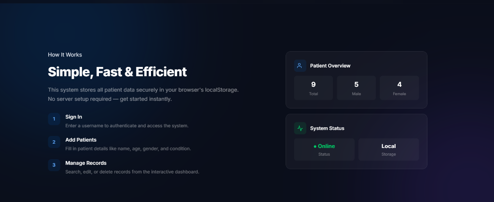
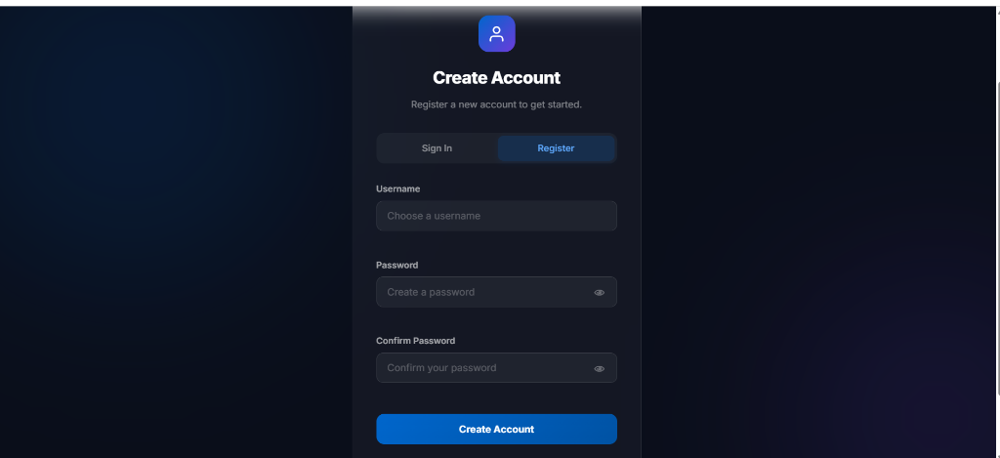
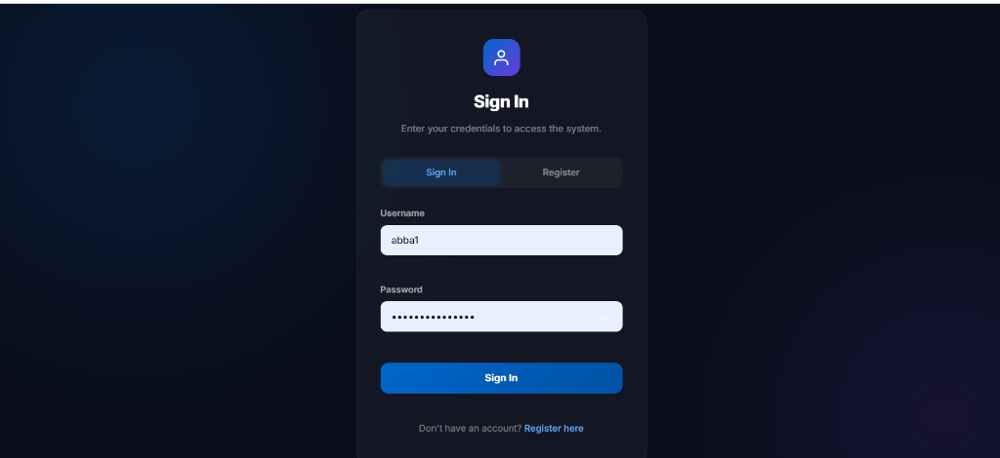
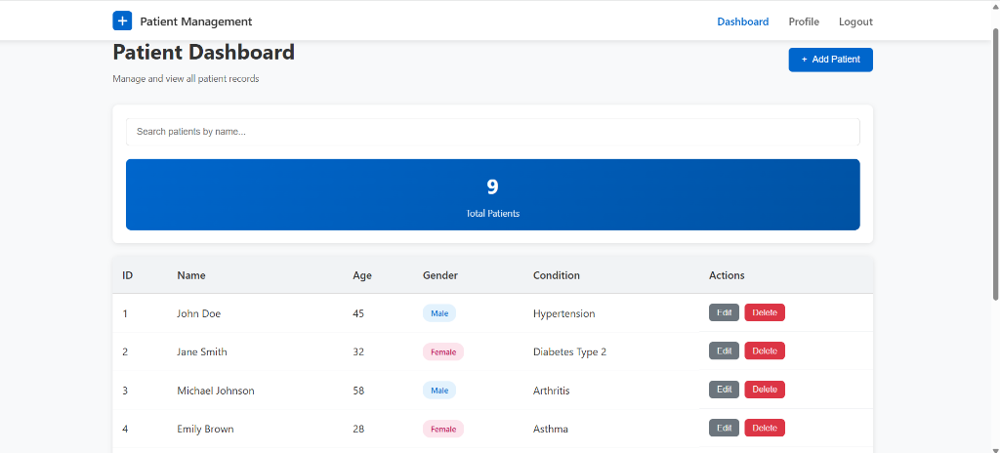
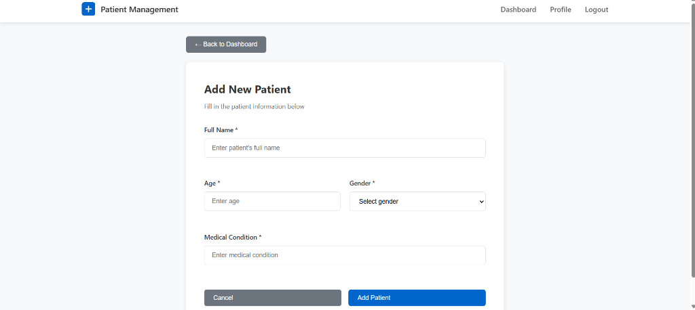
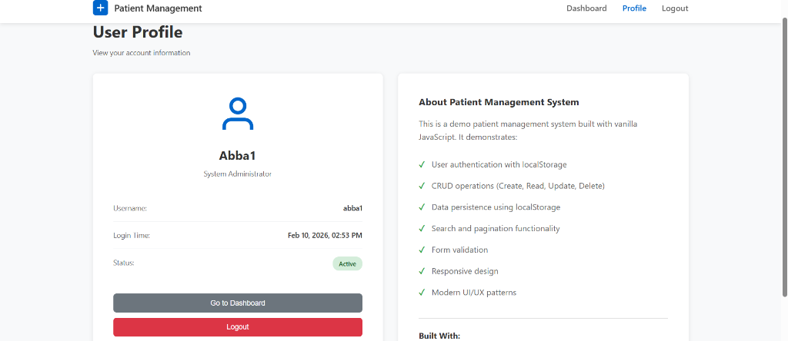
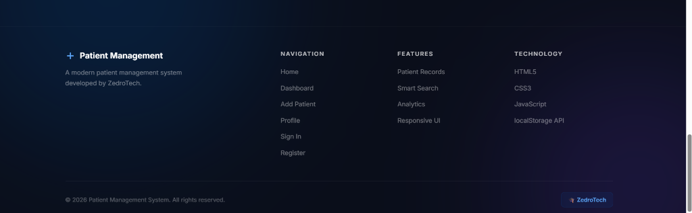

# 🏥 Beginner's Guide: Patient Management System
### A Complete Step-by-Step Tutorial by ZedroTech

Welcome to the **Patient Management System** project! This guide will help you understand every single part of the application you've built. We will explain **where** the files are, **what** they do, and **how** they work together in simple language.

---

## 📁 Part 1: How Your Project is Organized
A professional project is like a well-organized office. Everything has its own drawer so you can find it easily.

### The Main Folders
1.  **`assets/img/`**: This is where all your **pictures** and screenshots are stored. 
2.  **`css/`**: This folder contains the **beauty** of your site. It has the instructions for colors, fonts, and layouts.
    *   `main.css`: The "Master Rules" for the whole site.
    *   `home.css`: Special rules just for the landing page.
    *   `auth.css`: Special rules for the login and registration boxes.
3.  **`js/`**: This is the **brain** of your site. It contains all the logic.
    *   **`js/modules/`**: Small, reusable tools (like a "Login Checker" or a "Pop-up Alert") that many pages use.
    *   **`js/pages/`**: The specific instructions for each page (like "How the Dashboard works").

---

## 🏠 Part 2: The Landing Page (The Front Door)
This is the first thing people see. It needs to look great and tell them what to do.

### The Hero Section

- **What it is**: The main "Welcome" area.
- **How it works**: The big text uses a "Gradient" (colors that blend) to look modern. The buttons change depending on if you are logged in or not.

### The Features Section

- **What it is**: This tells users what the app can do (Search, Save, Secure).
- **The Magic**: We use a "Grid" layout. This is like a set of invisible boxes that automatically move to fit on a phone or a laptop screen.

### How it Works

- **What it is**: A simple 1-2-3 guide for the user.
- **The Magic**: We use "Icons" (simple pictures) to make it easy to read at a glance.

---

## 🔑 Part 3: The Security System (Authentication)
Before seeing patient data, users must "Sign In" so the information stays private.

### Registration (Setting up an account)

- **What it is**: Where new users create their username and password.
- **The Brain**: When you click "Register," the site saves your info into a place called **`localStorage`**. This is like a small notebook inside your web browser that remembers you.

### Login (Coming back)

- **What it is**: Where you enter your details to get in.
- **The Brain**: The site checks the "notebook" (`localStorage`) to see if your password is correct.

---

## 📊 Part 4: The Dashboard (Managing Data)
This is where the real work happens. You can see your patients, search for them, or delete them.

### The Data Table
- **What it is**: A list of all your patients.
- **The Magic**: 
  - **Searching**: When you type in the search box, the table instantly hides anyone who doesn't match. 
  - **Stats**: The big number at the top (Total Patients) automatically counts how many people are in your list.

### Adding a New Patient

- **What it is**: A simple form to type in a name, age, and medical condition.
- **The Magic**: The site checks your typing. If you leave a box empty, it will show a red warning. Once you click "Add," it saves the new person to your "notebook" (`localStorage`) automatically.

---

## 👤 Part 5: User Profile

- **What it is**: A page showing **your** information.
- **How it works**: It pulls your username and the exact time you logged in from the browser's memory and displays it here.

---

## 🚀 Part 6: Going Live (Deployment)
Now that your project is finished, you want to show it to the world!

1.  **GitHub**: Think of this as a "Safe Cloud" for your code. You upload your files here so you never lose them.
2.  **Vercel**: This is a service that takes your code from GitHub and turns it into a real website with a link (URL) you can share with anyone.
3.  **The Best Part**: Every time you change your code on GitHub, Vercel automatically updates your website. This is called **Auto-Deployment**.

---

### ✅ Your Project Checklist
- [ ] Do I have an `assets/` folder with images?
- [ ] Is my CSS separated into the `css/` folder?
- [ ] Is my logic separated into the `js/` folder?
- [ ] Can I Add, Search, and Delete a patient?
- [ ] Is my site live on Vercel?

**You've built and deployed a professional application! Be proud of your work. 🚀**
